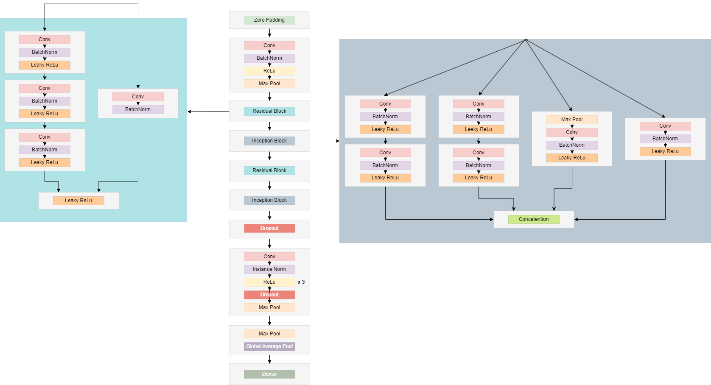

# CardiacAbnormalitiesClassification

### Proposed Architecture:

Firstly, we used 1D convolutional layers to extract high-level features with batch normalization, and in the 1D max pool layer the input dimensions were reduced. Then used a residual block for extracting low-level feature representations and connected with a skip connection so that the weights are transferred later in the network so that we dont have a vanishing gradient problem. Then used the inception network to extract more low-dimensional features parallelly followed by 3 convolutional blocks. Afterward, a dropout layer if the network overfits then 20 percent of the neurons should be dropped. Then in the last step, we used a convolutional block three times to extract complex patterns in the data due to high variance. Finally, the 1D max pool layer and 1D global average pooling layer were used then we flatten the data into a single dimension to connect it by a dense layer to classify.

In the first convolutional layer, 512 filters were used with a size of 5x5 followed by a batch normalization layer and relu activation. 1D Max pool layer with a filter size of 3x3 and stride 2x2 was used for downsampling the data and preserving the prominent features. 

In residual block, three stacks of a 1D convolutional layer with batch normalization layer and leaky relu were used. The alpha for leaky relu was again set to 1e-2. The number of filters of each stack of the convolutional layer was 128, 128, and 256 respectively with a size of 1x1. In the skip connection, another convolutional layer with 256 filters was used with batch normalization which was then connected with the output of the third stack of the residual block to preserve the weights.

In inception block stacks of 1D convolutional layers followed by batch normalization layer and leaky relu with alpha 1e-2 were used. The filters used in all stacks were 64, with kernel sizes 1, 3, and 5 respectively. 

Lastly, three convolutional blocks were added. In the first stack of convolutional block 1D convolutional layer was added with 128 filters and 5x5 filter size and stride 1x1 followed by an instance normalization layer and parametric relu as activation function. Then a dropout layer was added with a probability of 20 percent and a 1D max pooling layer with filter size 2x2 was added. In the second convolutional block, only the number of filters in the convolutional layer was different than the first stack. In the second stack, 256 filters with 11x11 size were used in 1D convolutional layer. Whereas, in the third stack of the convolutional block we didnt add the 1D pooling layer and used 512 filters with size 21x21 in the convolutional layer.

### Results

| Model  | Test Scores - Kaggle |
| ------------- | ------------- |
| Simple ANN  | 18.5  |
| LeNet  | 15.7  |
| AlexNet  | 33.8  |
| VGG-16  | 34.9  |
| Resnet-50  | 35.1  |
| Inception  | 40.6  |
| Inception-Residual  | 51.3  |
